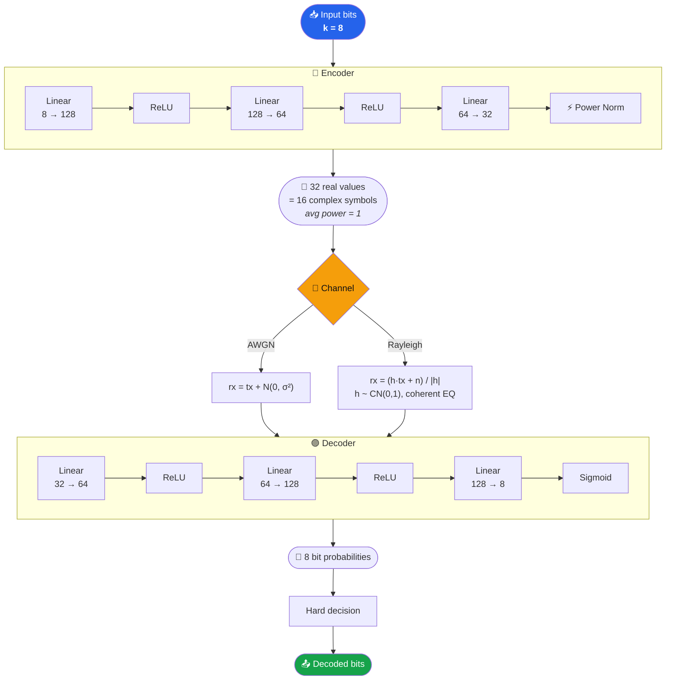

<div align="center">

# 📡 AE-Lite
### A Lightweight Neural Autoencoder Transceiver for End-to-End Wireless Communication

*BSc Thesis · School of Electrical and Computer Engineering · Addis Ababa University*

**Author:** Henok Belayneh &nbsp;·&nbsp; **Advisor:** Dr. Tsegamlak Terefe &nbsp;·&nbsp; **Year:** 2025–2026

[](https://colab.research.google.com/drive/YOUR_NOTEBOOK_ID_HERE)


*Learning the transmitter and receiver together — no hand-designed modulation, no hand-designed coding.*

</div>

---

## 📑 Table of Contents

- [Overview](#-overview)
- [Architecture](#-architecture)
- [Repository Structure](#-repository-structure)
- [Quickstart](#-quickstart)
- [Training Details](#-training-details)
- [M2: Diagnostic Constellation Study](#-m2-diagnostic-constellation-study)
- [GitHub Auto-Upload](#-github-auto-upload)
- [References](#-references)
- [License](#-license)

---

## 🔍 Overview

**AE-Lite** is a lightweight, single-carrier autoencoder transceiver trained **end-to-end** for physical-layer wireless communication. Instead of hand-designing separate modulation, coding, and detection blocks, the system learns an optimal transmitter–receiver pair jointly using a small MLP trained with binary cross-entropy loss.

The model is benchmarked against uncoded BPSK and QPSK over **AWGN** and **Rayleigh flat-fading** channels at coding rate:

<div align="center">

**R = k/n = 8/16 = 0.5 bits/complex symbol**

</div>

> [!NOTE]
> The whole system — encoder, channel, and decoder — is trained as a *single* differentiable pipeline. The channel itself sits inside the computation graph, so gradients flow straight through it during backprop.

---

## 🏗️ Architecture



<div align="center">

| Parameter | Value |
|:--|:--|
| Input bits `k` | 8 |
| Complex symbols `n` | 16 |
| Coding rate `R` | 0.5 bits / complex symbol |
| Encoder | `Linear(8,128) → ReLU → Linear(128,64) → ReLU → Linear(64,32) → Power Norm` |
| Decoder | `Linear(32,64) → ReLU → Linear(64,128) → ReLU → Linear(128,8) → Sigmoid` |
| Output activation | Sigmoid |
| Loss function | Binary Cross-Entropy (BCELoss) |
| Optimizer | Adam |
| Trainable parameters | ~50,000 |
| Training platform | Google Colab T4 GPU |

</div>

<details>
<summary><b>⚡ Power Normalisation</b> — click to expand</summary>
<br>

After the encoder's final linear layer, the output is normalised so that average energy per complex symbol equals 1:

```python
tx = x / (||x|| / sqrt(n) + 1e-8)
```

</details>

<details>
<summary><b>🌊 Rayleigh Channel</b> — click to expand</summary>
<br>

Fading coefficients `h ~ CN(0,1)` are drawn per sample (flat fading). Coherent equalisation divides the received signal by `|h|` before decoding.

</details>

---

## 📂 Repository Structure

```
ae_lite/
├── ae_lite_model.py           # Encoder, Decoder, AWGNChannel, RayleighChannel, AELite
├── ae_lite_train.py           # Training script with CLI args and checkpointing
├── ae_lite_eval.py            # BER evaluation and plotting
├── ae_lite_colab.py           # All-in-one single-cell version for Colab
├── upload_to_github.py        # Auto-uploads results to this repo from Colab
├── results/
│   └── colab_t4/
│       ├── M1_AWGN_FINAL/     # Main AWGN training results
│       ├── M1_RAY_FINAL/      # Main Rayleigh training results
│       ├── M2_AWGN_2dB/       # Diagnostic constellation runs
│       ├── M2_AWGN_8dB/
│       ├── M2_AWGN_15dB/
│       ├── M2_RAY_2dB/
│       ├── M2_RAY_8dB/
│       └── M2_RAY_15dB/
└── checkpoints/
    └── colab_t4/              # Mirrors results folder structure above
```

> [!TIP]
> **Drive layout (Colab):** `MyDrive/[04]Projects/BSc-Thesis-project/ae_lite/`

---

## 🚀 Quickstart

### Option A — Google Colab <sub>(recommended)</sub>

Click the badge at the top, or open the notebook directly:

```
https://colab.research.google.com/drive/YOUR_NOTEBOOK_ID_HERE
```

<details open>
<summary><b>Notebook cell map</b></summary>
<br>

| Cell | Purpose |
|:--:|:--|
| **1** | Mount Google Drive, verify GPU, set up directory structure |
| **2** | Model definition (`Encoder`, `Decoder`, `AWGNChannel`, `RayleighChannel`, `AELite`) |
| **3** | Training — edit `CHANNEL` (`'awgn'` or `'rayleigh'`) and `NUM_EPOCHS` at the top |
| **4** | BER evaluation over `SNR_RANGE = np.arange(0, 21, 2)` |
| **5** | BER overlay plot + learned constellation |
| **6** | Master evaluation — loads both final models, produces a combined BER overlay |
| **7** | Persistent storage verification — lists saved files on Drive |
| **8** | GitHub uploader — pushes results and checkpoints via the API |
| **9** | M2 diagnostic matrix — 6-run constellation study (fixed-SNR training) |

</details>

**Steps:**
1. `Runtime → Change runtime type → T4 GPU`
2. ▶️ Run **Cell 1** — mounts Drive, verifies GPU
3. ▶️ Run **Cell 2** — model definition
4. ▶️ Run **Cell 3** — training
5. ▶️ Run **Cell 4** — BER evaluation
6. ▶️ Run **Cell 5** — plots

### Option B — Local

```bash
# Clone the repo
git clone https://github.com/henibela/Neural-codes.git
cd ae-lite

# Create and activate environment
conda create -n ae-lite python=3.10
conda activate ae-lite
pip install torch numpy matplotlib scipy

# Smoke test
python ae_lite_model.py

# Train
python ae_lite_train.py --channel awgn --epochs 10000

# Evaluate
python ae_lite_eval.py --model ae_lite_final_awgn.pt --n_bits 1000000 --constellation
```

---

## 🎯 Training Details

<div align="center">

| Setting | Value |
|:--|:--|
| Run IDs | `M1_AWGN_FINAL`, `M1_RAY_FINAL` |
| Epochs | 50,000 (resumable from checkpoints at 10k, 30k) |
| Batch size | 256 |
| Learning rate | 1e-4 |
| SNR strategy | Random uniform, 0–20 dB per batch |
| Checkpoint interval | Every 2,000 epochs |
| Training time (T4 GPU) | ~4 min / 10k epochs |

</div>

Loss starts at **~0.693** (log 2, random-guess baseline) and converges to **<0.1** at full training.

<details>
<summary><b>🔁 Resuming Training</b> — click to expand</summary>
<br>

The notebook supports resuming from a checkpoint (Cell 5 resume block):

```python
CHANNEL       = 'rayleigh'
TARGET_EPOCH  = 50000
RESUME_EPOCH  = 30000   # checkpoint to load
```

</details>

<details>
<summary><b>🏷️ Run ID Convention</b> — click to expand</summary>
<br>

| Channel | LR ≤ 1e-4 | LR > 1e-4 |
|:--|:--|:--|
| `awgn` | `M1_AWGN_FINAL` | `M1_AWGN_{N}k` |
| `rayleigh` | `M1_RAY_FINAL` | `M1_RAY_{N}k` |

</details>

---

## 🔬 M2: Diagnostic Constellation Study

Cell 9 runs 6 short fixed-SNR experiments to visualise how the learned constellation geometry varies with channel type and operating SNR:

<div align="center">

| Run ID | Channel | Fixed SNR | Epochs |
|:--|:--:|:--:|:--:|
| `M2_AWGN_2dB` | AWGN | 2 dB | 5,000 |
| `M2_AWGN_8dB` | AWGN | 8 dB | 5,000 |
| `M2_AWGN_15dB` | AWGN | 15 dB | 5,000 |
| `M2_RAY_2dB` | Rayleigh | 2 dB | 5,000 |
| `M2_RAY_8dB` | Rayleigh | 8 dB | 5,000 |
| `M2_RAY_15dB` | Rayleigh | 15 dB | 5,000 |

</div>

Each run saves a constellation plot and loss curve. Failures are caught per-run so the loop continues regardless. 🛡️

---

## ☁️ GitHub Auto-Upload

`upload_to_github.py` pushes results from Drive to the repo using the GitHub Contents API. It requires a personal access token stored in Colab Secrets:

```
Left sidebar → 🔑 Secrets → Add new secret
Name: GITHUB_PAT    Value: ghp_xxx...
```

Files are uploaded to:
- `results/colab_t4/` — `.png` and `.npy` files, preserving run subfolders
- `checkpoints/colab_t4/` — `.pt` checkpoint files, preserving run subfolders

---

## 📚 References

1. T. J. O'Shea and J. Hoydis, "An introduction to deep learning for the physical layer," *IEEE Trans. Cogn. Commun. Netw.*, vol. 3, no. 4, pp. 563–575, Dec. 2017.
2. S. Dörner et al., "Deep learning-based communication over the air," *IEEE J. Sel. Topics Signal Process.*, vol. 12, no. 1, pp. 132–143, Feb. 2018.
3. A. Felix et al., "OFDM-autoencoder for end-to-end learning of communication systems," *IEEE SPAWC*, 2018.
4. N. Abdul Haq et al., "BER performance of BPSK and QPSK over Rayleigh channel and AWGN channel," *IJEETC*, vol. 3, no. 2, 2014.

---

## 📄 License

MIT License. See `LICENSE` for details.

<div align="center">

*Built with 🧠 + 📡 at Addis Ababa University*

</div>
